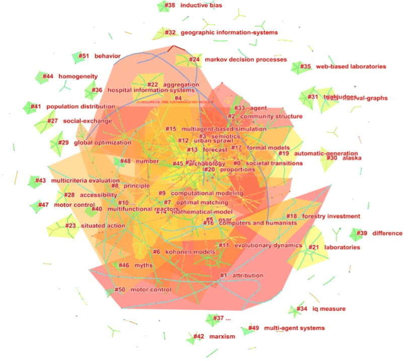

# 计算传播学：传播学研究新视角

## 概述

近年来，由于人们获取信息、传播信息的方式的显著变化，经典的大众传播理论范式已经无法满足现实需要。而涉及领域广泛的计算传播学应运而生蓬勃发展，包括但并不局限于如新闻与信息扩散研究，社会化媒体的采纳、使用与效果研究，社会网中的媒体行为与人际行为研究，创意媒体产品的社会化生产与消费研究等等。

## 一、研究背景和学科发展历史

关于计算传播学的整体学科的体系建构主要基于以下诱因：

（1）复杂网络科学理论的发展和推动。Lazer等学者2009年在《科学》[1]杂志上发表了题为《计算社会科学》（Compuational social science）的文章,在这篇论文当中，计算社会科学的概念被正式提出。Lazer等人强调了大规模的数据收集和数据分析以及网络科学视角对于计算社会科学扮演者至关重要的作用，提出计算社会科学研究可以帮助研究者揭示个体和群体行为的模式。

（2）多主体建模和计算机模拟。现阶段对于传播研究而言，源于1996年Neumann等人的的元胞自动机[2]理论的多主体建模研究方法被越来越多地应用在了舆论动力学等研究领域。而作为复杂性科学的组成部分，动力学（dynamic）理论关注的是如何描述和预测：在某个系统中，各个组成部分的群体行为变量当中呈现出整体层面上的复杂适应行为。

（3）大规模的人类传播数据挖掘。2007年，网络科学的重要研究者D. Watts在《自然》杂志上发表了题为《一个二十一世纪的科学》的论文[3]。Watts认为社会科学将成为在二十一世纪获得重要发展的研究领域，其主要原因来源于互联网大数据的使用和从网络科学出发的研究视角。

## 二、相关研究

《计算传播学导论》一书中分析了2009年之后的计算社会科学文献的引用参考网络，如下所示[4]：

从被引用的期刊和文献而言，前十名的期刊主要来自综合类的期刊（如《科学》、《自然》等期刊）、社会学、计算机科学、心理学和物理学等学科，值得注意的是这些期刊是整个科学领域最重要的期刊，因此展现了计算社会科学的跨学科特点和吸引力（见表格1）：

| 类别      | 期刊    | 引用次数 
|:----------|:-------------|:-------------|
| 综合 | SCIENCE, 1997, SCIENCE, V, P |120|
| 综合  |NATURE, 1998, NATURE, V, P|120|
| 综合  |P NATL ACAD SCI USA, 2002, P NATL ACAD SCI USA, V, P|89|
|社会学|Am J SOCIOL, 1981, AM J SOCIOL, V, P|46|
计算机|Lect NOTES COMPUT SC, 1995, LECT NOTES COMPUT SC, V, P|35| 
心理学|Psychol REV, 1956, PSYCHOL REV, V, P	|34

在现阶段，伴随着互联网技术和社交网络的兴起和发展，自然科学与社会学科在某些交叉点再度重逢，二者都在以复杂的心态审视着对方。自然科学领域的研究者开始关于社会系统，而社会科学的研究者们也开始学习使用各种复杂精致的分析工具，以上表格资料都从侧面表现了作为交叉性明显的包括计算传播学在内的计算科学的学科魅力所在。

## 三、影响信息传播的可计算因素分析

### 3.1度相关性
度相关性即是一条边的两个节点度值之间的相关性，一般使用度值的Pearson相关系数来刻画。度相关性在网络中的扩散扮演着重要的角色，它会对信息的传播和速度产生重要影响。对于无标度网络而言，网络中的度相关性会影响信息扩散的阈值和最终扩散的规模，增加网络的相关性可以显著地抑制扩散。无标度网络中存在大量的度值小的节点，增加度相关性意味着度值小的节点倾向于连接在一起，而非连向度值大的节点。此外，网络的度相关性也会影响信息传播的速度。在同配（趋于和它近似的节点相连）无标度网络中，如果度值大的节点担当加速者的角色，那么扩散会变慢。而在异配网络（与同配网络性质相反）中，如果度值大的节点担当延迟者的角色，那么扩散也会变慢。

关于社会关系的无标度性，其基本观点是符合二八开马太定律：由少数主导信息传播。比如说2016年初的携程「假机票」风波：除去传播深度，传播走势，引发负面情绪等方面的不同外，传播层级、转发峰值、影响人群等，还受到一个重要的因素影响，那就是意见领袖，或者称「引爆点」。

### 3.2小世界特性 

小世界特性是指社交网络中具有聚类系数大、平均最短路径小的特点。在规则网络在引入少量随机连接，就会产生既不同于规则网络也不同于随机网络的小世界网络。在图论中，聚类系数通常用来表示拓扑图形中节点的聚集程度。

对于不同的信息传播网络类型和传播规则，小世界特性会对新信息扩散产生不同的影响。小世界特性会对简单类型的信息传播有推动作用，而在对于复杂传播（Complex contangion）级联动力学的研究发现，与直觉认知相反的是，对于该类研究，相对于规则网络而言，随机的链接效果反而更差。小世界特性对于简单传播和复杂传播的作用不同，其原因在于复杂传播需要社会增强效应，随机连接削减了这种效应，因而阻碍了传播，而简单传播不需要这种效应，因此随机连接的引入可以增强的扩散。

### 3.3 意见领袖和影响力节点

从数据到模型，作为「天然实验场」的社交网络和社会化媒体的出现，对于传播学当中的意见领袖理论研究有着重要的意义。

参考Delre等研究者提出的一个基于多智能体的创新扩散模型[5]，可以将小世界特性中的影响力节点（Hub节点）作为量化意见领袖的影响力的基底。在无标度网络中，当Hub节点的最大连接数有上限时，创新扩散会受到严重的阻碍，而当Hub节点对用户决策影响增强时，创新扩散却不会受到本质性的推动。因此，Hub节点确实有助于网络中的信息传播，但并没有特别强的说服用户采纳新产品的能力。

### 3.4 内容分析与文本挖掘

在社会化网络中，用户是如何演化成为有影响力的节点或意见领袖的？在Huffaker等人对于在线社区中人们是如何成为意见领袖的研究中，该研究使用了三种测量方法量化用户的在线影响力[6]：
1. 激发回复，即某用户在发布一条帖子后收到的回复数。
2. 激发对话，类似于微博中的转发层次。
3. 语言扩散，即他人是否沿用该用户所使用的词语，用其后发布信息与该用户所使用的词语相似度来进行运算。

2014年皮尤研究中心发布报告称，发现Twitter上的主要讨论会话有六种场景结构[7]：
1. polarized crowd
2. tight crowd
3. brand clusters
4. community clusters
5. broadcast network
6. support network

2015年12月，学者刘知元，张乐等人也在期刊《中国科学》上发表社会媒体处理专题论文《中文社交媒体谣言统计语义分析》[8]，以上发现和定义引入都是在社交传播网络上一次内容分析法和语义分析建模的典型实践案例。

### 3.5 其他可计算性传播的参考指标

基于信息传播的可计算性因素，《社交网络上的计算传播学》一书中选取了一些具有代表性的指标进行比较分析[9]，表格中的时间复杂度计算来自计算机科学，即在衡量某个算法的效率时，将算法的时间量度，其中f（n）是求解问题规模n的某个函数。

## 四、基于可计算性传播的编程入门

在计算传播学中，借助某类编程工具辅助研究是非常有效的方法。除了广为人知的MATLAB和R语言，在社会网络分析中，Python作为一种广泛使用的高级编程语言，也提供了诸如SNAP，igraph等非常丰富的网络分析工具。

对于分析社交网络数据而言，使用Python进行辅助编程往往需要经过以下几个阶段：

（1）数据抓取。尽管现阶段社交网络上分享的公开数据集很多，但仍然不能完全满足研究者的需要，而在数据抓取阶段，有以下三种途径获取数据：直接从网页上抓取数据，模拟浏览器登陆抓取数据以及基于API（Application Programming Interface,应用程序编程接口）接口抓取数据。在这一阶段，可能涉及到是使用到Python的类库如urllib获取待抓取页面的html文本，BeautifulSoup对于页面进行数据解析。如果需要借用到浏览器的cookie功能或者与API进行进行交互，还需要借助于cookielib或者request库，以及由网站方提供的SDK（Software Development Kit）。

（2）数据预处理。研究者通过一定的计算规则对于数据进行预处理，对于研究者的编程素养要求不算很高，关键在于其对数据量化的算法框架是否科学合理。

（3）数据可视化。数据可视化，是一个将预处理好的数据集用图形化等方式呈现出来，方法和工具都不唯一。这一阶段，可以使用到的是Python本身的科学计算类库`Numpy`，`Scipy`，`Matployli`。众多开源（Open Source，开放源码）的科学计算软件包也提供了对于Python的调用接口如OpenCV。由贝尔实验室开发的绘图工具Graphviz也是选择之一，只需要研究者「告知」`Graphiviz`需要在绘图中包含的元素以及元素之间的关系，Graphviz就可以自动生成样式优美的关系图形。

（4）基于节点，网络，传播等不同属性维度的数据分析。在这一阶段，主要是根据节点，网络，传播等属性维度对数据集进行分析，挖掘其背后的深刻联系。其中节点属性通过包括节点间的距离，平均路径的长短；传播属性包括传播发生过程中的时空和用户特征，而网络属性而更关注于网络规模，聚类系数和相关匹配度等。

## 五、思考与总结 

如果将描述当下社会形态的后喻文化的特质引申泛化到不同学科的交流之间，我们同样可以发现学科反哺在计算传播学的学科发展过程也不同程度地存在着。而由于不同领域的研究范式和关注点的不同，如果没有一个信息传播可计算的理论框架领域，多个理论对于信息传播的研究是碎片化的，同一个科学问题在不同领域的研究成果也无法相互借鉴。解决这一问题的可能方式是融合多个学科的力量，为信息传播再造一个研究框架，即计算传播学。

但同时我们也应该清楚：并非所有社会科学领域的研究对象都可以清晰地量化，对于数学模型的滥用也可能产生不良的负面效果。在21世纪，种种与信息传播有关的社会现象卷入了海量的异质性的个体存在之间的互动之中，因而包括传播学在内的社会科学研究现象可以说是最难定量定性研究的科学问题之一。 

正如Jerome Kagan在其著作《三种文化：21世纪的自然科学、社会科学和人文学科》指出，过度依赖数学模型的滥用会使得研究者沉浸在种种自负的迷宫和无用的符号中，而忽视其背后存在着的真实客观的联系。要求模型清晰性的代价是对复杂系统尽可能地简化，最终缺失了严格忠于实际存在现象的精神。[10]

将社会化计算引入传播学的优势如下：在大数据时代，不同场景下的数字化痕迹使得用户的个体行为都变得有迹可循。作为包含时间和空间等多维变量的第一手详细资料，为研究传播链条上的行为演化提供了宝贵的可能性。相对于传统的使用自上而下的演绎推理的内容分析，社会化计算其验证逻辑主要是基于归纳推理，更加适用于未来不断变革的社会化媒体环境，其对于大数据的处理能力显然也是传统的劳动密集型内容方法所不能企及的。此外，社会学计算中非介入式的研究方法优势为新闻传播研究提供了除去自我报告数据之外的另一种选择。

而作为计算科学和传播学的交叉学科，想必今后不断迭代发展的计算传播学的发展还需要进一步借鉴、融入跨学科的思考和沉淀，优秀的学科知识也终将击穿浮华的一切，借着时代的东风而更加欣欣向荣。

## 参考文献

[1]Lazer et al，compuational social science[J]，Science.V323.6,2009.2

[2]John von Neumann,Theory of Self-Reproducing Automata[M], 1996

[3]D. Watts，A twenty-first century science[J]，Nature，2007:445-489

[4]王成军，计算传播学：作为计算社会科学的传播学[J].《中国网络传播研究》2014年00期：193-194

[5]DELRE SA，JACER W，BIJMOLT THA，Will it spread or not？The effects of social influence and network topology on innovation diffusion[J]，Journal of Product Innovation Managemnt，2010,27(2):267-282

[6]HUFFAKER D. Dimensions of leadership and social in online communities[J],Human Communication Research，2010,36(4):593-617

[7]Andrea Peterson.The six types of conversations on Twitter[J]，Washington Post，2014(2)

[8]刘知远,张乐,涂存超,孙茂松,中文社交媒体谣言统计语义分析[J].《中国科学》2015年第45卷第12期：1536-1546

[9]许小可，胡海波，张伦等,社交网络上的计算传播学[M]，北京：高等教育出版社，2016:59-60

[10]Jerome Kagan,三种文化：21世纪的自然科学、社会科学和人文学科[M],上海：格致出版社，2011:14-16

---

> 作者: [Wake](https://wakehuang.com/about)  
> URL: https://wakehuang.com/computational-communication/  

